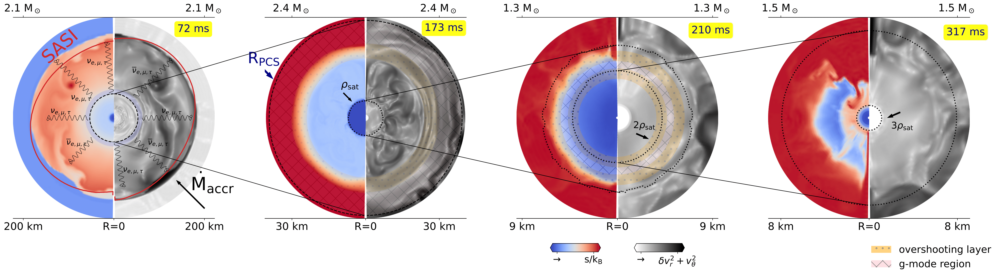

<html>
<head>
<meta name="viewport" content="width=device-width, initial-scale=1.0">

<h2 align="left"><u>Core <i>g</i>-mode from the proto-compact star</u></h2>

 
Radially resolved gravitational wave signal for a 35 M\(_\odot\) progenitor.
The signal corresponds to a quadrupole \(g\) mode inside the proto-compact star. 
The upper panel shows the gravitational wave amplitude at 5km, 6km, and 8km.

 
 

<video width="200" playsinline style="padding:1px;border:1px solid black;"
controls="controls" loop="true" autoplay="true" src="/videos/heatmap_z35_cmf.mp4">
</video>

<small><i> z35:CMF </i></small>  
<small>See <a href="https://github.com/PiaJakobus/GW_extraction">Code</a>

<h2 align="left"> <u>Illustrative view of the proto-compact star</u></h2>

An illustrative diagram of the post-bounce evolution of an 85 M\(_\odot\) progenitor in the postbounce phase of a core-collapse supernova. The diagram comprises four distinct time steps (going clockwise). In each figure, the left panel shows specific entropy per baryon; the right panel displays the velocity dispersion as an approximate for turbulent convective motion \(\delta v_r\) representing the deviation of radial velocity \(v_r\) from its azimuthal average \(\langle v_r\rangle_\theta\).

Pink-hatched regions show zones that are buoyantly stable and susceptible to quadrupolar oscillations, where gravity acts as the restoring force. Yellow/black dotted areas depict overshooting regions. Convective plumes, the standing accretion shock instability (SASI), and mass accretion downflows extend into these regions, albeit at different times and to varying extents. These transport energy into the $g$-mode region, causing it to oscillate and emit gravitational waves at a characteristic mode frequency.
 
 
 
 
 

 
 
<h1 align="left"><u>Quasi-statistical equilibrium</u></h1>

<video width="200" playsinline style="padding:1px;border:1px solid black;"
controls="controls" loop="true" autoplay="true" src="/videos/x_cl.mp4">
</video>

<small><i> QSE </i></small> 

